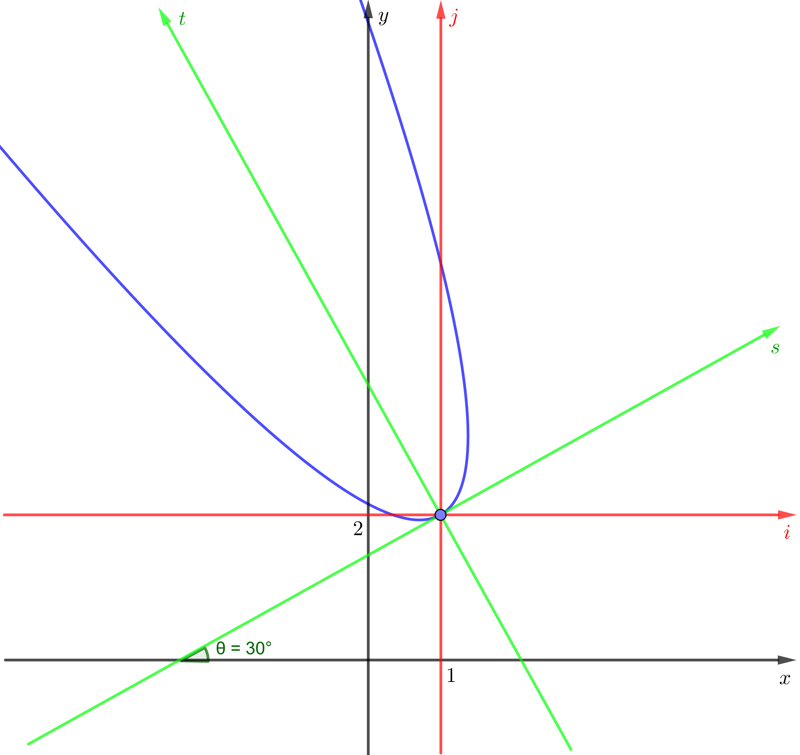

.. ga-182-trab documentation master file, created by
   sphinx-quickstart on Fri Nov 16 21:17:59 2018.
   You can adapt this file completely to your liking, but it should at least
   contain the root `toctree` directive.

GA 2018.2 -- Prof. Fernando Náufel -- Trabalho
==============================================

.. default-role:: math

.. toctree::
   :maxdepth: 3
   :caption: Conteúdo:

   enunciado

   
Representando cônicas rotacionadas
----------------------------------

Alguns programas de computação algébrica permitem especificar uma
cônica (por exemplo, uma parábola) do seguinte modo:

.. math::

   y - 2 = (x - 1)^2, \qquad \frac{\pi}{6}

A primeira parte da especificação é a *equação canônica* de uma
parábola com vértice no ponto `V = (1, 2)` e eixo focal paralelo
ao eixo `Oy`, como na figura abaixo:

.. image:: _static/fig01.png
           :align: center
           :width: 90%

Mas a segunda parte da especificação --- o ângulo `\frac{\pi}{6}` ---
significa que a parábola está *rotacionada* de 30 graus *em torno do
seu vértice*, em relação ao sistema de eixos `Oxy`.

Ou seja, a especificação

.. math::

   y - 2 = (x - 1)^2, \qquad \frac{\pi}{6}

representa, na verdade, a seguinte parábola rotacionada:

Este modo de especificar cônicas facilita a nossa vida, pois não
precisamos dar a equação geral da parábola rotacionada no sistema
`Oxy`, que é mais trabalhosa de calcular e que tem a forma

.. math::

   Ax^2 + Bxy + Cy^2 + Dx + Ey + F = 0

(Mas como este é um trabalho, e como o objetivo de todo trabalho é dar
trabalho, uma das suas tarefas vai ser exatamente achar esta equação
geral.)

                   
Problemas com esta notação
--------------------------
                   
Existe um problema aqui.
   
No curso, vimos que, numa parábola com equação `y-k = a(x-h)^2`, o
foco é o ponto `F = (h, k+\frac{1}{4a})`.

Vamos calcular as coordenadas do foco da parábola do nosso exemplo:

.. math::

   y - 2 = (x - 1)^2, \qquad \frac{\pi}{6}

Aqui, os valores são `h = 1`, `k = 2`, `a = 1`. Então, o foco seria

.. math::

   F = \left( 1, \frac{9}{4} \right)

Certo? Veja a figura:

Errado! Este ponto não é o foco da parábola. O foco da parábola sempre
fica sobre o *eixo focal* (dã...).

Eis o local correto do foco:

O problema é que, embora a equação da parábola use as variáveis `x` e
`y`, a equação, na verdade, se baseia em *outro* sistema de eixos
coordenados, rotacionado de `\frac{\pi}{6}` radianos a partir do eixo
`Ox`.

(Neste trabalho, uma outra tarefa sua vai ser calcular as coordenadas
corretas deste foco, no sistema `Oxy`)

Vamos mudar nosso sistema de eixos (duas vezes!) para resolver esta
confusão.

A equação mais simples para esta parábola
-----------------------------------------

No curso, no início da matéria sobre parábolas, usamos um sistema de
eixos cuja *origem* coincidia com o *vértice* da parábola e cujo *eixo
vertical* coincidia com o *eixo focal* da parábola.

Vamos fazer a mesma coisa aqui, chamando os eixos de `s` e `t`:

.. image:: _static/fig05.png
           :align: center
           :width: 90%

No novo sistema `st`, nossa parábola tem a equação mais simples
possível:

.. math::

   t = s^2

Perceba que o valor de `a` não muda quando fazemos rotações e
translações dos eixos coordenados.   

Convertendo esta equação para o sistema `Oxy`
---------------------------------------------

Agora vamos transformar esta equação para o sistema `Oxy` original.

O primeiro passo vai ser desfazer a rotação.

Desfazendo a rotação
~~~~~~~~~~~~~~~~~~~~

Vamos mudar para um terceiro sistema de coordenadas, cuja origem
coincide com a origem do sistema `st`, mas cujos eixos estão
rotacionados para ficar paralelos aos eixos `Ox` e `Oy`.

Vamos chamar este terceiro sistema de `ij` e desenhá-lo em vermelho:

Qual o ângulo entre o eixo `i` e o eixo `s`?

Em outras palavras, qual o ângulo da rotação que temos que desfazer?

O próprio `\theta`, ora!

As coordenadas `(s, t)` se relacionam com as coordenadas `(i, j)`
pelas igualdades vistas no curso:

.. math::

   \begin{cases}
   s &= \phantom{-}i \cos\theta + j \text{ sen }\theta \\
   t &= -i \text{ sen }\theta + j \cos\theta
   \end{cases}

Use estas igualdades para traduzir a equação da parábola do sistema
`st` para o sistema `ij`.

Isto é, substitua as variáveis `s` e `t` na equação `t = s^2` e use
`\cos \frac{\pi}{6} = \frac{\sqrt{3}}{2}` e `\text{sen }\frac{\pi}{6}
= \frac{1}{2}` para obter uma equação geral no sistema `ij` da forma
   
.. math::

   A'i^2 + B'ij + C'j^2 + D'i + E'j + F' = 0

"Descendo" para o sistema `Oxy`
~~~~~~~~~~~~~~~~~~~~~~~~~~~~~~~

Agora só falta fazer uma translação dos eixos `i` e `j` para baixo e
para a esquerda, para chegar ao sistema `Oxy`.

Olhando para o gráfico, qual você acha que é a relação entre
coordenadas no sistema `ij` e coordenadas no sistema `Oxy`?

Complete as igualdades abaixo:

.. math::

   \begin{cases}
   i &= x \ldots \\
   j &= y \ldots
   \end{cases}

Em seguida, substitua as variáveis na equação da seção anterior para
achar a equação geral da parábola original no sistema `Oxy`, da forma

.. math::

   Ax^2 + Bxy + Cy^2 + Dx + Ey + F = 0

Pronto. Você achou a equação geral da parábola original no sistema
`Oxy`.

Suas tarefas
------------

1. Preencha todos os detalhes do raciocínio acima e escreva a equação
   geral da parábola original no sistema `Oxy`.

2. Calcule as coordenadas, no sistema `Oxy`, do foco da parábola
   original.

   Atenção: aqui, você precisa de igualdades que exprimam `i` e `j` em
   função de `s` e `t`, e de igualdades que exprimam `x` e `y` em
   função de `i` e `j`.

3. Escreva a equação, no sistema `Oxy`, da diretriz da parábola
   original.

4. Para cada uma das equações abaixo, escolha os valores reais que
   você quiser (respeitando as condições) para os parâmetros `a`, `b`,
   `h`, `k` e `\theta`:

   a. `\frac{(x - h)^2}{a^2} + \frac{(y - k)^2}{b^2} = 1`, ângulo
      `\theta`

   b. `\frac{(x - h)^2}{a^2} - \frac{(y - k)^2}{b^2} = 1`, ângulo
      `\theta`

   Condições:

   * `a, b \neq 0`

   * `a, b \neq 1`

   * `a \neq b`

   * `h, k \neq 0`

   * `0 < \theta < \frac{\pi}{2}`

5. Envie para o grupo da disciplina no Telegram as equações com os
   valores reais escolhidos. Cada aluno deve escolher um conjunto
   diferente de valores.

6. Para cada uma das equações com os valores reais que você deu:

   a. Desenhe a cônica no sistema de eixos `Oxy`.

   b. Desenhe o sistema de eixos `st`, indicando o ângulo `\theta`.

   c. Desenhe o sistema de eixos `ij`.

   d. Desenvolva, em detalhes, o raciocínio para achar, no sistema
      `Oxy`, a equação geral da cônica.

   e. Calcule as coordenadas e as equações, no sistema `Oxy`, de todos
      os elementos importantes da cônica:

      * Se elipse: vértices (4) e focos (2).

      * Se hipérbole: vértices (2), focos (2) e assíntotas (2).

Resumindo: cada aluno (sim, o trabalho é individual) precisa achar as
equações e os elementos importantes de uma elipse e uma hipérbole.

Bom trabalho.
